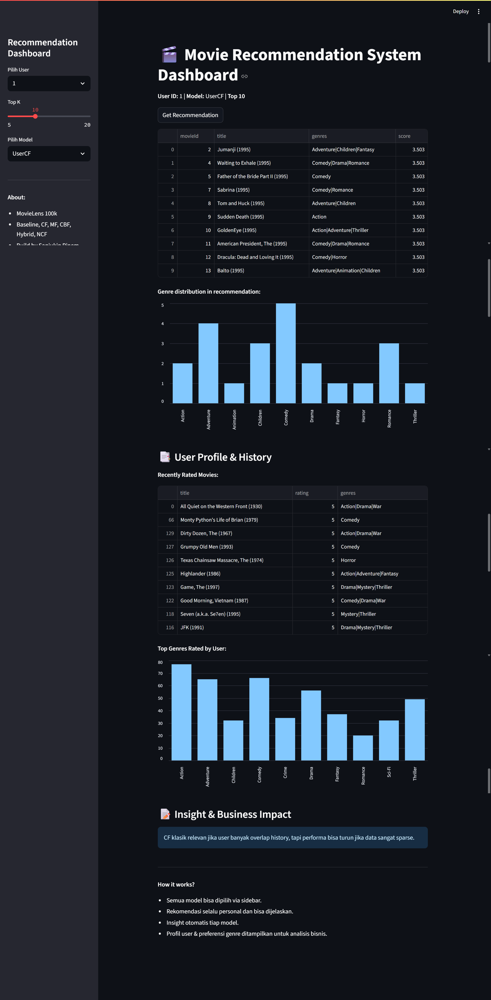

# Movie Recommender System – End-to-End Portfolio

## Live Demo

**Dashboard Streamlit (Live):**
[https://movie-recommender-sanju.streamlit.app/](https://movie-recommender-sanju.streamlit.app/)

---

## Project Overview

Sistem rekomendasi film end-to-end dengan berbagai pendekatan—**baseline, collaborative filtering, matrix factorization, content-based, hybrid, dan neural recommendation**—dibangun dengan standar industri, scalable, dan siap produksi.

Tujuan utama:

- **Personalized movie recommendation**
- Showcase skill data science, machine learning, evaluasi model, dan deployment modern
- Platform eksplorasi “why” dan “how” dari setiap teknik sistem rekomendasi

---

## Fitur Utama

- **Baseline Modeling:** Random & Popularity recommendation
- **Collaborative Filtering:** User-User, Item-Item, dan Matrix Factorization (SVD/Surprise)
- **Content-Based Filtering:** Profil user dari tag/title embedding (sentence-transformers)
- **Hybrid Recommendation:** Weighted & Switching (menggabungkan MF dan CBF)
- **Neural Collaborative Filtering (NCF):** Deep learning ranking model (TensorFlow)
- **Interactive Streamlit Dashboard:**

  - Pilih user, model, dan top-N
  - Visualisasi profil user (top genre, film favorit, riwayat rating)
  - Analisis hasil rekomendasi (genre distribution, evaluasi metrik)
  - Slot insight otomatis untuk setiap model

---

## File Structure

```
.
├── app/
│   ├── dashboard.py           # Streamlit dashboard (main UI)
│   └── main.py                # (Opsional, untuk serving API/manual)
├── data/
│   ├── raw/                   # Data MovieLens mentah (csv)
│   └── processed/             # Data yang sudah di-clean/split/embedding
├── models/                    # Model & mapping hasil training (.pkl, .h5)
├── notebooks/                 # Notebook EDA, modeling, visualisasi
├── src/
│   ├── utils.py               # Semua function helper rekomendasi & evaluasi
├── README.md
└── requirements.txt           # Semua dependencies (lihat bawah)
```

---

## Screenshots & Visualisasi

### Dashboard Utama

- _Dashboard Streamlit: pemilihan user, model, top-K, dan hasil rekomendasi_
- _Profil user: genre favorit, history rating, chart distribusi genre, dsb_



## How It Works

### 1. Data Preparation & EDA

- Analisis statistik, distribusi rating, genre, dan sparsity matrix
- Data splitting: train-test per user (real-world simulation)
- Cleaning dan feature engineering untuk genre/tags

### 2. Baseline & Classical Recommender

- Random Recommender
- Popularity Recommender

### 3. Collaborative Filtering & Matrix Factorization

- User-User/Item-Item CF (cosine similarity, Pearson)
- Matrix Factorization dengan SVD (Surprise)
- Analisis kelebihan, kelemahan, cold start

### 4. Content-Based Filtering

- Embedding tags/title dengan Sentence Transformers
- User profile via weighted average embedding
- Similarity search untuk rekomendasi personalized

### 5. Hybrid Model

- Weighted Hybrid: skor gabungan SVD + CBF (tuning alpha)
- Switching Hybrid: otomatis pilih model tergantung history user

### 6. Neural Collaborative Filtering (NCF)

- Model deep learning untuk ranking
- Data pipeline, mapping, dan serving hasil ke dashboard

### 7. Evaluasi & Analisis

- Evaluasi precision\@K, recall\@K, hit rate\@K
- Visualisasi distribusi metrik antar user
- Insight bisnis dan error analysis

### 8. Interactive Dashboard

- **Pilih user, model, dan top-K**
- **Lihat rekomendasi yang dihasilkan tiap model**
- **Bandingkan insight & evaluasi di satu tempat**
- **Profil user otomatis: genre favorit, riwayat rating**

---

## Requirements

```txt
cython>=0.29
pandas==2.2.2
numpy==1.26.0
matplotlib==3.7.4
seaborn==0.13.2
scikit-learn==1.5.0
streamlit==1.47.0
tensorflow==2.19.0
scikit-surprise==1.1.4
sentence-transformers==2.7.0
tqdm
scipy==1.9.3
# lightfm (opsional, skip jika error di Python 3.11+)
```

> **Catatan:**
> Jika install `lightfm` gagal, gunakan Python 3.9 atau 3.10, pastikan `build-essential`, `python3-dev` terpasang (Linux), atau skip dulu tanpa LightFM.

---

## How to Run (Local)

1. Clone repo ini
2. Buat virtual environment dengan Python 3.9/3.10 (rekomendasi)
3. Install dependencies:

   ```
   pip install -r requirements.txt
   ```

4. Jalankan Streamlit dashboard:

   ```
   streamlit run app/dashboard.py
   ```

5. Buka di browser: [http://localhost:8501](http://localhost:8501)

---

## Dataset

- [MovieLens 100k](https://files.grouplens.org/datasets/movielens/ml-latest-small.zip)
- Fitur: userId, movieId, rating, timestamp, genres, tags, title

---

## Author

Dibuat oleh **Sanjukin Pinem**
[LinkedIn](https://www.linkedin.com/in/sanjukin-pinem/) | [Email](sanju329121@gmail.com)

---
